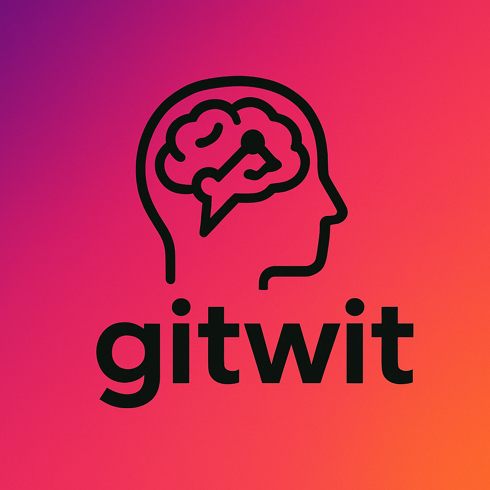
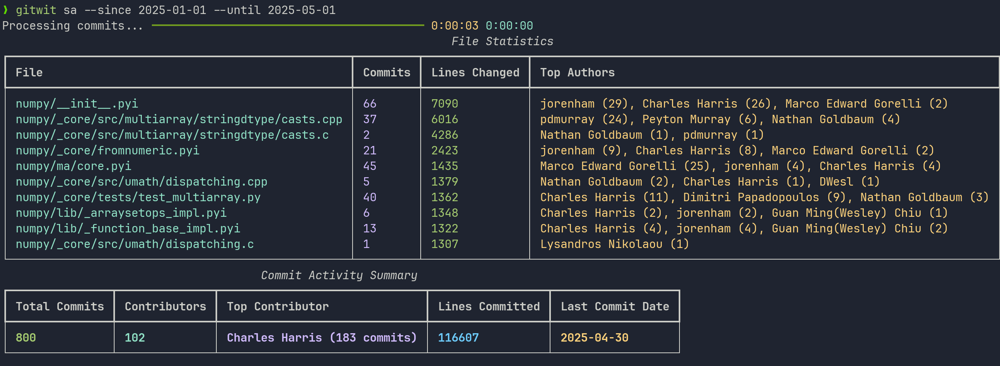
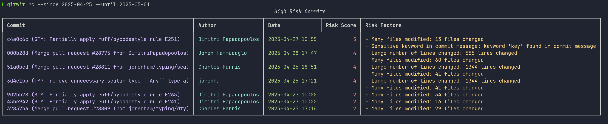

  <!-- CI badge -->
    
  <!-- Python versions badge -->
  

    

# GitWit
> DISCLAIMER: this project is currently in development

GitWit is a CLI tool that extracts, analyzes, and summarizes Git information to help everyone from team leads to fresh faced junior developers make better, faster, more informed decisions with a couple of key strokes. No api calls required, no payments, it only uses the information already available in your git repositories and runs locally.

## Problem Statment
This project aims to synergise two statements:

1. In fast-moving software teams git history(s) holds a wealth of insight into team dynamics, code health, and development velocity. 

2.  Engineering leads need visibility into contributions, review cycles, etc.. and new developers need to ramp up quickly by understanding who's working on what, which parts of the codebase are active, etc...

By analysing the data available in *1* and exposing it in an appealing way, we can improve the ways all of the needs in *2* are addressed  

# Installation Guide
To install gitwit you can simply:
1. Clone the repo
2. Ensure you have sourced into a python venv
3. run `pip install .`

From then on you should be able to use it in any Git repository on your machine

# Commands Manual

## Team Activity
Scans the git repo history for a given time period and calculates the activity of all of the authors during that period (lines added, deleted, etc...)

>Use Case: You want to review the health of your dev team, and identify if anyone is struggeling hitting blocks, so you can quickly help them out

#### Command: `gitwit ta`
- `--since`: the start date of the scan data (in `YYY-MM-DD` format) 
- `--until`: the end date of the scan data (in `YYY-MM-DD` format) 

#### Exmaple Output

## Show Activity
Scans the git repo history for a given time period and calculates the most active files and an overview of the number of commits, contributors

>Use Case: you recently noticed a change in behaviour in your app and want to see where work has recently been done to identify what changed

#### Command: `gitwit sa`
- `--since`: the start date of the scan data (in `YYY-MM-DD` format) 
- `--until`: the end date of the scan data (in `YYY-MM-DD` format) 

#### Exmaple Output

## Who is the expert?
Scans the git blame data in a file or an entire directory you specify, and determines a ranking of code oweners in that region, as well as highlighting the last commit they did in that region.

>Use Case: You need to find a domain expert for a region of the code you're investigating

#### Command: `gitwit wte`
- `--path`: the path or file you want to scan
- `--num-results`: number of author results to display

#### Exmaple Output

## Risky Commits
Scans the git repo history for content considered risky, such as commits with many file changes, many line changes, or commit messages with content like "refactor" or "fix"

>Use Case: you're about to deploy your app but want to check for any risky commits you might be deploying

#### Command: `gitwit rc`
- `--since`: the start date of the scan data (in `YYY-MM-DD` format) 
- `--until`: the end date of the scan data (in `YYY-MM-DD` format) 

#### Exmaple Output

## Latest Example Of
Scans git repo to identify the latest example of a given file for example "controller.py".

>Use Case: you're adding a certain type of file for the first time and want to identify the latest implementation standards, and docs are out of date

### Command: `gitwit leo`
- `search-term`: the file string you want to match agains (ie `.py`) 
- `--dirs`: the directories you want to scan for examples of the search term
- `--authors`: filters commits to fuzzy match the author you want an example from
- `--limit`: limits the number of example files returned

#### Exmaple Output

## Hot Zones
Scans git repo for the hotest zones of activity where hotness is the most commits impacting that directory in the period.

>Use Case: You want to contribute code to a directory but are unsure if it's an active area of development or fairly untouched in recent times

### Command: `gitwit hz`
- `--since`: the start date of the scan data (in `YYY-MM-DD` format) 
- `--until`: the end date of the scan data (in `YYY-MM-DD` format) 
- `--dirs`: directories to recursively scan for hotzones
- '--author': filter the scan by commits by a defined author
- `--limit`: limits the number of example files returned

#### Exmaple Output

# Future Development: 
- Move away from GitPython and use native git cli functions to avoid excessive hydration of git data
- Introduce a CSV export option on all methods
- 